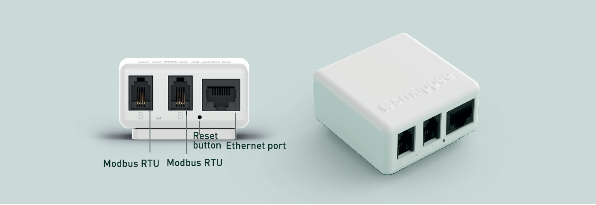

# Python Smappee Connect

## Smappee Connect device



The Smappee connect:

* IP network : to allow it to connect to the Smappee cloud
  * 1x RJ45 Ethernet
  * 1x Wifi
* Modbus RTU: for internel communicatin in between Smappee modules
  * 2x Modbus RTU (RS485)

## Enabling Modbus TCP

Send a mail to Smappee support and ask them to enable it. The Smappee Connect does not host the [expert portal](https://support.smappee.com/hc/en-gb/articles/360045277952-How-to-access-the-monitor-s-expert-portal) website.

## Find your Smappee device

The app or online dashboard does not expose the IP address of your device, you'll need to login

### Via your router its DHCP table

It's exposed as 'espressif' device

```
(192.168.0.253) at 1c:9d:c2:d8:e2:4b
```

### Via MAC address in the ARP table

Lookup the device via its MAC entry in the ARP table:

```
$ arp -a | grep "1e:"
? (192.168.0.158) at 1e:8c:79:b3:75:f4 [ether] on wlp0s20f3
```

Check if it has the modbus port open;

```
$ sudo nmap -p- -sS -T5 -n -Pn 192.168.0.253
Starting Nmap 7.94SVN ( https://nmap.org ) at 2026-05-14 00:04 CEST
Nmap scan report for 192.168.0.253
Host is up (0.0024s latency).
Not shown: 65534 closed tcp ports (reset)
PORT    STATE SERVICE
502/tcp open  mbap
MAC Address: 1C:9D:C2:D8:E2:4B (Espressif)

Nmap done: 1 IP address (1 host up) scanned in 29.26 seconds
```

## Usage

```
python smappee_connect.py <ip>
```

Example:

```
$ python smappee_connect.py -a 192.168.0.253
Connecting to 192.168.0.253:502 (device_id=61) ...
Connected.

=== General Config ===
  Phantom voltages : disabled
  Modbus address   : 61
  Device type      : Smappee Power Box
  Serial number    : 29342
  Firmware version : 1.76

=== Frequency ===
  Nominal frequency : 50.0 Hz
  Actual frequency  : 49.994 Hz
  Run time          : 29648678 s

=== Bus Devices ===
  Dev  DevType                         Slots        Serial        FW  Channels
  --------------------------------------------------------------------------------
    0  unknown (0)                         0             0       0.0  
    1  Smappee Solid Core 3-Phase CT       3         16462      1.36  A=3, B=4, C=5
    2  Smappee CT Hub                      4          8944       1.2  A=6, B=7, C=8, D=9
    3  unknown (0)                         0             0       0.0  
    4  unknown (0)                         0             0       0.0  
    5  unknown (0)                         0             0       0.0  
    6  unknown (0)                         0             0       0.0  
    7  unknown (0)                         0             0       0.0  
    8  unknown (0)                         0             0       0.0  
    9  unknown (0)                         0             0       0.0  

=== CT Configuration ===
  CT  Voltage             Slot  Type
  -------------------------------------------------------
   0  L1-N (Normal)          3  Closed CT
   1  L2-N (Normal)          4  Closed CT
   2  L3-N (Normal)          5  Closed CT
   3  L1-N (Normal)          6  SCT02-50A
   4  L2-N (Normal)          7  SCT02-50A
   5  L3-N (Normal)          8  SCT02-50A
   6  L1-N (Normal)          9  SCT02-50A
   7  none                   1  SCT01-50/100/200A
   8  none                   2  SCT01-50/100/200A
   9  none                   0  SCT01-50/100/200A
  10  none                  10  SCT01-50/100/200A
  11  none                  11  SCT01-50/100/200A
  12  none                  12  SCT01-50/100/200A
  13  none                  13  SCT01-50/100/200A
  14  none                  14  SCT01-50/100/200A
  15  none                  15  SCT01-50/100/200A
  16  none                  16  SCT01-50/100/200A
  17  none                  17  SCT01-50/100/200A
  18  none                  18  SCT01-50/100/200A
  19  none                  19  SCT01-50/100/200A
  20  none                  20  SCT01-50/100/200A
  21  none                  21  SCT01-50/100/200A
  22  none                  22  SCT01-50/100/200A
  23  none                  23  SCT01-50/100/200A
  24  none                  24  SCT01-50/100/200A
  25  none                  25  SCT01-50/100/200A
  26  none                  26  SCT01-50/100/200A
  27  none                  27  SCT01-50/100/200A

=== Power (W / var / VA) ===
  Ch     Act.Tot    Act.Fund   React.Tot  React.Fund     App.Tot    App.Fund     Instant
  --------------------------------------------------------------------------------------
   0        1.96        1.99       -0.80       -0.78        3.47        2.14        1.97
   1        0.00        0.00        0.01        0.01        0.02        0.01        0.00
   2        0.01        0.01        0.01        0.01        0.02        0.02        0.02
   3       12.86       12.95      -69.60      -69.37       72.45       70.59       13.83
   4       54.81       55.59      -56.62      -56.07      107.11       79.03       53.24
   5      512.47      513.08      -82.68      -81.21      539.54      519.49      504.02
   6       -8.37       -8.41       46.52       46.39       48.20       47.17       -7.44
   7        0.00        0.00        0.00        0.00        0.00        0.00        0.00
   8        0.00        0.00        0.00        0.00        0.00        0.00        0.00
   9        0.00        0.00        0.00        0.00        0.00        0.00        0.00
  10        0.00        0.00        0.00        0.00        0.00        0.00        0.00
  11        0.00        0.00        0.00        0.00        0.00        0.00        0.00
  12        0.00        0.00        0.00        0.00        0.00        0.00        0.00
  13        0.00        0.00        0.00        0.00        0.00        0.00        0.00
  14        0.00        0.00        0.00        0.00        0.00        0.00        0.00
  15        0.00        0.00        0.00        0.00        0.00        0.00        0.00
  16        0.00        0.00        0.00        0.00        0.00        0.00        0.00
  17        0.00        0.00        0.00        0.00        0.00        0.00        0.00
  18        0.00        0.00        0.00        0.00        0.00        0.00        0.00
  19        0.00        0.00        0.00        0.00        0.00        0.00        0.00
  20        0.00        0.00        0.00        0.00        0.00        0.00        0.00
  21        0.00        0.00        0.00        0.00        0.00        0.00        0.00
  22        0.00        0.00        0.00        0.00        0.00        0.00        0.00
  23        0.00        0.00        0.00        0.00        0.00        0.00        0.00
  24        0.00        0.00        0.00        0.00        0.00        0.00        0.00
  25        0.00        0.00        0.00        0.00        0.00        0.00        0.00
  26        0.00        0.00        0.00        0.00        0.00        0.00        0.00
  27        0.00        0.00        0.00        0.00        0.00        0.00        0.00

Connection closed.
```

Use `-f` option to follow power updates.

## Development

### Venv

```
python -m venv .venv
source .venv/bin/activate
pip install -r requirements.txt
```

## References

* [Smappee Modbus registers Excel sheet](doc/Smappee-Infinity-Modbus-energy-meter-registers-2026.xlsx)